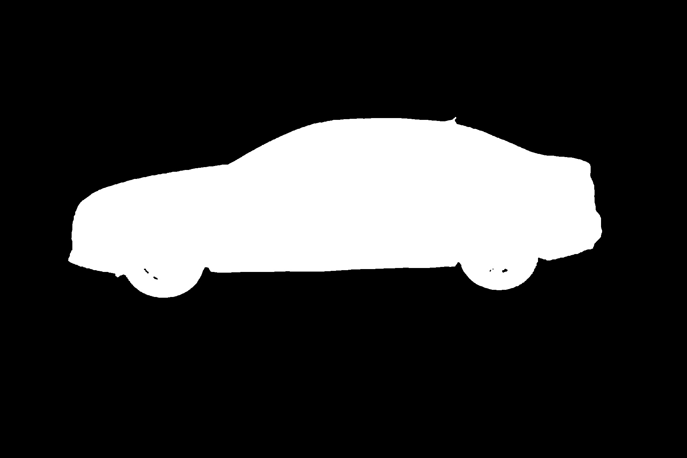

# unet-rgb

Keras(TF backend) implementation of unet for RGB pictures.

---

## Overview
### Requirement
- OpenCV
- Python 2.7
- Tensorflow-gpu
- Keras

### Data
You can download all data here:

### Howtouse
- extract downloaded data to corresponding directories
- run ```python data.py``` to generate 3 .npy files or you can download them to npydata
- run ```python unet.py``` to train, you can change hyperparameters on your own situation
- run ```python test2mask2pic.py``` to get test results(pictures)

### Results
After training about 30 epochs, loss goes to about 0.005.The results seems OK! But the edges look a bit rough. I think that is Unet's own limitation.




## About
Unet is mostly used in medical areas. I used this model for semantic segmentation of satellite remote sensing images in real work and the result is not bad. I think one of the reason is that it's a coarse-grained task like medical image analysis. Of course, enough labeled images are necessary.

## Reference
https://github.com/zhixuhao/unet